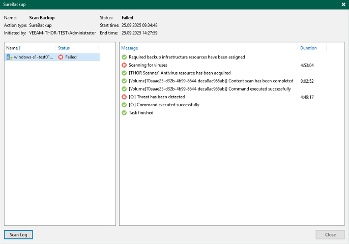

# Integration of THOR into Veeam Backup & Replication

This guide explains how to integrate the Nextron THOR forensic scanner into Veeam Backup & Replication in order to scan restore points for attacker artefacts and anomalies.

---

## Prerequisites
- Veeam Backup & Replication installed
- THOR scanner with valid license file

---

## Step 1 – Place THOR

Extract the THOR scanner into the following directory:

```
C:\Program Files\THOR
```

Make sure the license file is located in the same directory.


---

## Step 2 – Adjust Veeam Mount Services

Navigate to:

```
C:\Program Files\Common Files\Veeam\Backup and Replication\Mount Service
```

Open the file:

```
AntivirusInfos.xml
```

Edit the listing of the antivirus software and add the following entry for THOR:

```
<Antiviruses>
...
  <!-- THOR Scanner-->
  <AntivirusInfo Name='THOR Scanner' IsPortableSoftware='true' ExecutableFilePath='%ProgramFiles%\Thor\thor64.exe' CommandLineParameters='-a Filescan --intense --threads -2 --norescontrol --cross-platform --follow-symlinks --nothordb -e %ProgramFiles%\Thor -p %Path%' RegPath='' ServiceName='' ThreatExistsRegEx='ALERTS:\s*[1-9]\d*|WARNINGS:\s*[1-9]\d*' IsParallelScanAvailable='false'>
    <ExitCodes>
      <ExitCode Type='Success' Description='Command executed successfully'>0</ExitCode>
      <ExitCode Type='Infected' Description='A threat was detected on the system'>1</ExitCode>
    </ExitCodes>
  </AntivirusInfo>
</Antiviruses>
```

Save the changes.


---

## Step 3 – Change Veeam Configuration

In the Veeam Console:

1. Go to **Menu → Inventory → Settings** (top left).
2. Select the **Signature Detection** tab.
3. Change the setting from  
   `Veeam Threat Hunter Recommended`  
   to  
   `Bring your own antivirus (Slower)`.
4. Confirm with **OK**.


---

## Step 4 – Start a Backup Scan

In the Veeam Console:

1. Navigate to **Home → Backups → Disks**.
2. Select the desired backup → right-click → **Scan Backup**.
3. In the **Scan Backup** dialog, check:  
   `Scan Restore Points with Your Existing Antivirus Software`.
4. Confirm with **OK**.

Veeam will now pass the job to THOR.


---

## Step 5 – Monitor the Scan

- Veeam hands off the job to **THOR**.
- **THOR** scans the restore points for forensic artefacts.



---

## Step 6 – Review the Findings

THOR scans the restore points for forensic artefacts.  
After completion, the reports are written to the output directory as:

- `.txt` (structured report)
- `.html` (for comfortable viewing in the browser)

---

## Result

With this integration, THOR complements existing antivirus integrations in Veeam by scanning backups for webshells, backdoors, obfuscated scripts, and other attacker artefacts.
